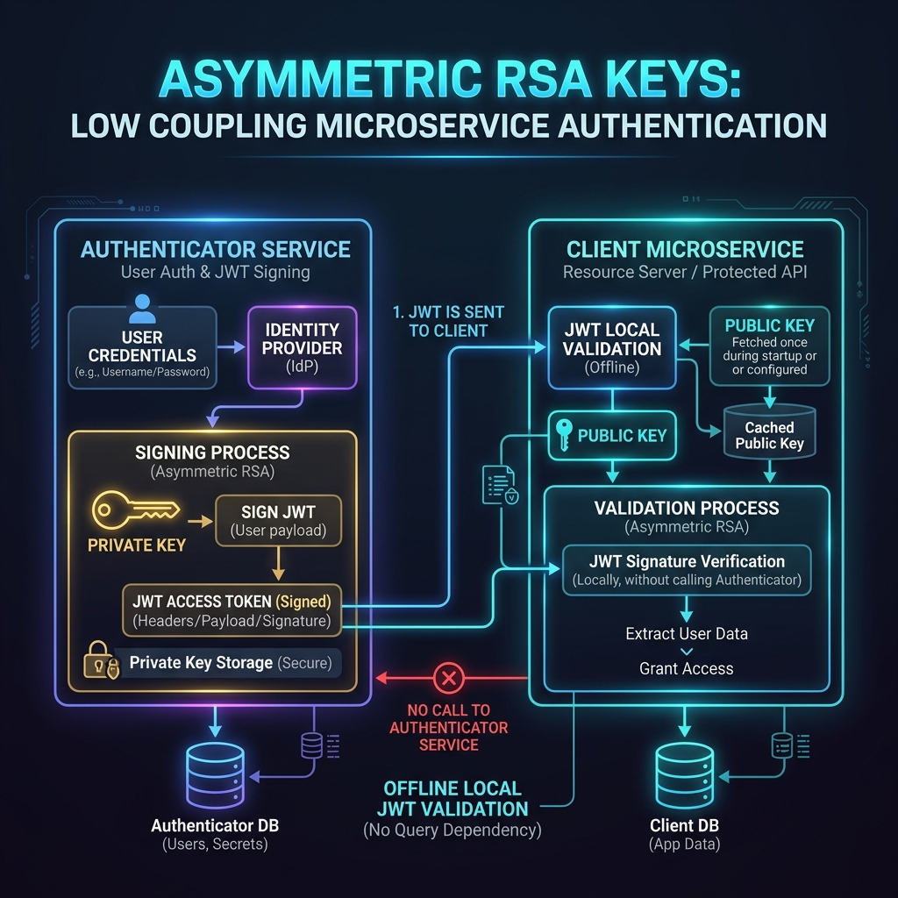
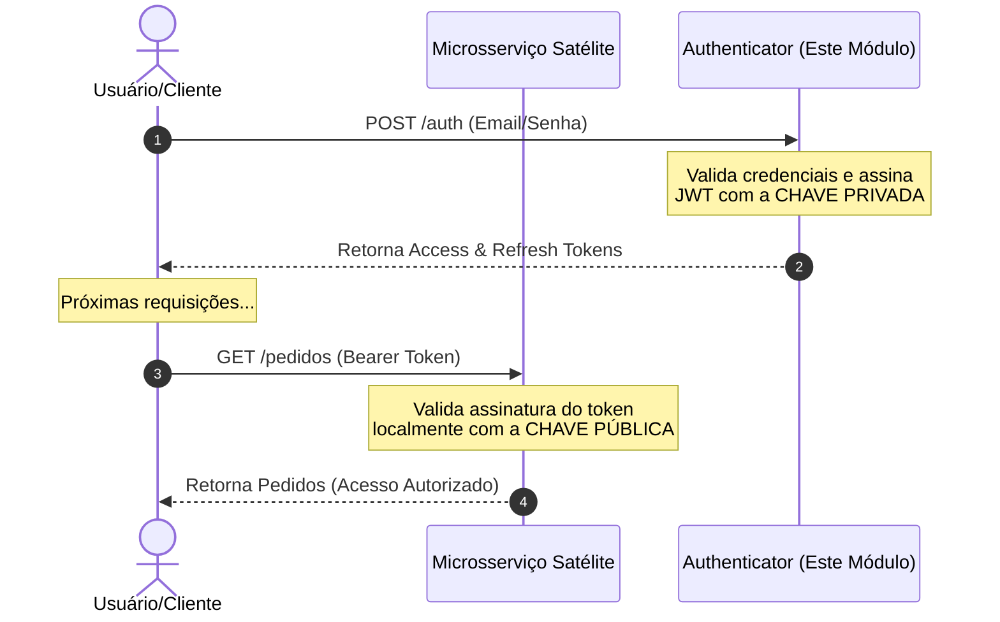
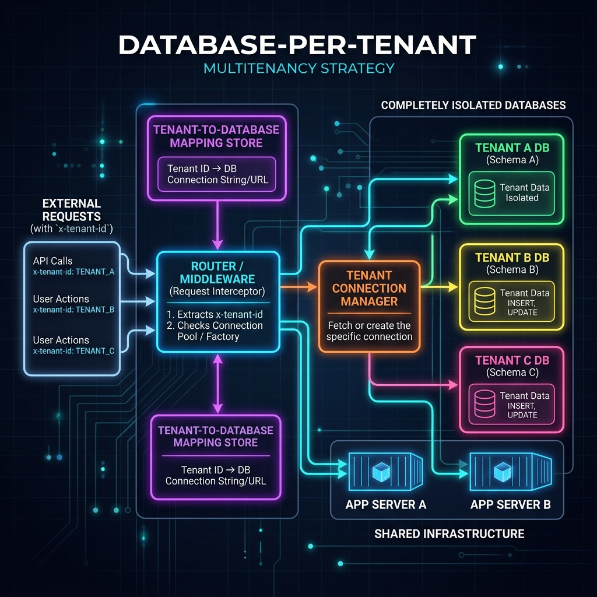

# 🔐 Módulo de Autenticação & Multitenancy (Authenticator)


Este projeto é uma API de autenticação robusta e modular desenvolvida em **NestJS**. Ele foi projetado para funcionar como um microsserviço independente ("plug and play") que centraliza a autenticação, o controle de acesso de usuários e o provisionamento dinâmico de **Tenants** (multilocação) com bancos de dados fisicamente isolados.

---

## 🚀 Filosofia de Arquitetura

### 1. Baixo Acoplamento com Criptografia Assimétrica (RS256)
Um dos maiores problemas em arquiteturas de microsserviços é a dependência excessiva e a sobrecarga de rede no microsserviço de autenticação. Para resolver isso, este projeto utiliza **chaves assimétricas (RSA 2048 bits)**:

*   **Chave Privada (`key`)**: Mantida em segurança absoluta apenas pelo serviço `Authenticator`. Ela é utilizada para assinar digitalmente o token JWT no momento do login.
*   **Chave Pública (`key.pub`)**: Pode ser compartilhada livremente com qualquer outro microsserviço satélite do seu ecossistema.

#### 💡 O Benefício da Validação Offline
Qualquer serviço satélite que possua a **chave pública** pode verificar a integridade e descriptografar o payload do token JWT de forma **100% offline**, sem fazer uma única requisição HTTP para o `Authenticator` e sem precisar ler o banco de dados de autenticação.



#### Fluxo de Comunicação:


---

### 2. Isolamento Multitenant Dinâmico (Database-per-Tenant)
O sistema suporta arquitetura multilocatária através da estratégia de **Banco de Dados Isolado**. Isso garante a máxima segurança e conformidade de dados entre diferentes clientes (Tenants).

*   **Criação de Tenant**: Ao criar um novo Tenant através da API (`POST /tenant`), o serviço executa dinamicamente o comando `CREATE DATABASE "<tenant_id>"` na instância PostgreSQL.
*   **Roteamento Dinâmico**: Aplicações clientes usam o cabeçalho HTTP `x-tenant-id` para identificar o contexto do locatário. A infraestrutura interna (`TenantProvider`) mapeia e resolve a conexão correspondente para o banco de dados daquele Tenant.



---

## 🛠️ Pré-requisitos

Para executar o projeto, você precisará de:
*   [Docker](https://www.docker.com/) e [Docker Compose](https://docs.docker.com/compose/) instalados.
*   Instância local ou remota do [PostgreSQL](https://www.postgresql.org/) (caso decida rodar fora do Docker).

---

## 📦 Como Executar o Projeto

### Opção 1: Via Docker Registry (Pronto para Produção)
Você pode utilizar a imagem pré-construída diretamente do GitHub Container Registry:

```bash
docker pull ghcr.io/marcospmc1/authenticator:latest
```

### Opção 2: Clonando e Executando Localmente

**1. Clone o repositório:**
```bash
git clone https://github.com/MarcosPMC1/Authenticator.git
cd Authenticator
```

**2. Geração das Chaves Assimétricas:**
Gere o par de chaves RSA na pasta raiz do projeto. O container irá mapeá-las automaticamente:
```bash
# Gerar a chave privada
openssl genpkey -algorithm RSA -out key -pkeyopt rsa_keygen_bits:2048

# Extrair a chave pública a partir da chave privada
openssl rsa -pubout -in key -out key.pub
```

**3. Configure as Variáveis de Ambiente:**
Crie um arquivo `.env` na raiz do projeto com base no modelo abaixo:
```env
NODE_ENV=dev
PORT=3000
POSTGRES_USER=postgres
POSTGRES_PASSWORD=postgres
POSTGRES_DATABASE=main
POSTGRES_HOST=postgres
POSTGRES_PORT=5432
```

**4. Inicie os Serviços:**
Suba o ecossistema com Docker Compose (inicia a API e a instância dedicada do PostgreSQL):
```bash
docker compose up -d
```

---

## ⚙️ Variáveis de Ambiente

| Variável | Descrição | Valor Padrão / Exemplo |
| :--- | :--- | :--- |
| `NODE_ENV` | Ambiente de execução da aplicação (`dev`, `prod`, `test`) | `dev` |
| `PORT` | Porta onde o servidor NestJS irá rodar | `3000` |
| `POSTGRES_USER` | Usuário administrador do PostgreSQL | `postgres` |
| `POSTGRES_PASSWORD`| Senha do banco de dados PostgreSQL | `postgres` |
| `POSTGRES_DATABASE`| Nome do banco de dados principal (armazena usuários/tenants) | `main` |
| `POSTGRES_HOST` | Host do PostgreSQL (no compose é o nome do service) | `postgres` |
| `POSTGRES_PORT` | Porta do PostgreSQL | `5432` |

---

## 🔌 Guia de Integração em Microsserviços Satélites

Para implementar a validação offline em qualquer outra API que você esteja criando (seja em NestJS, Express, Go, Python, etc.), siga o padrão abaixo utilizando a **Chave Pública (`key.pub`)**:

### Exemplo em Node.js (com a biblioteca `jsonwebtoken`):

```javascript
const jwt = require('jsonwebtoken');
const fs = require('fs');
const path = require('path');

// Carregue a chave pública que você obteve do Authenticator
const publicKey = fs.readFileSync(path.join(__dirname, 'key.pub'), 'utf8');

function verificarToken(req, res, next) {
    const authHeader = req.headers['authorization'];
    const token = authHeader && authHeader.split(' ')[1];

    if (!token) return res.status(401).json({ message: 'Token não fornecido' });

    // Validação offline do token JWT
    jwt.verify(token, publicKey, { algorithms: ['RS256'] }, (err, decoded) => {
        if (err) return res.status(403).json({ message: 'Token inválido ou expirado' });
        
        // Os dados do usuário estão disponíveis aqui sem nenhuma requisição externa
        req.user = decoded;
        next();
    });
}
```

---

## 📖 Documentação da API (Swagger)

Uma vez que o projeto esteja rodando, a documentação interativa e completa de todas as rotas e DTOs está disponível em:

🔗 **[http://localhost:3000/docs](http://localhost:3000/docs)**

### Principais Endpoints Disponibilizados

#### 👤 Autenticação (`/auth`)
*   `POST /auth/registrate` - Registra um novo usuário no sistema.
*   `POST /auth` - Realiza o login (retorna `access_token` [1 hora] e `refresh_token` [7 dias]).
*   `POST /auth/refresh` - Atualiza o `access_token` expirado utilizando o `refresh_token` ativo (Requer Guard).

#### 🏢 Tenants (`/tenant`)
*   `POST /tenant` - Cria um novo Tenant e inicializa seu respectivo banco de dados físico isolado.
*   `GET /tenant` - Retorna os Tenants associados ao usuário autenticado.
*   `POST /tenant/invite` - Associa um usuário a um Tenant existente.
*   `DELETE /tenant` - Remove um usuário de um Tenant.
*   `GET /tenant/list` - Lista todos os Tenants cadastrados (Restrito a administradores).

#### 👥 Usuários (`/users`)
*   `GET /users` - Retorna a lista de todos os usuários (Requer permissão Admin).
*   `PUT /users/:id` - Atualiza dados cadastrais de um usuário.
*   `DELETE /users/:id` - Deleta um usuário do sistema.

---

## 🛡️ Segurança Aplicada

O módulo já vem configurado de fábrica com práticas recomendadas de segurança cibernética:
1.  **Criptografia Hash Bcrypt**: Armazenamento seguro de senhas com fator de custo `11`.
2.  **Helmet.js**: Configuração automática de cabeçalhos HTTP HTTP seguros para mitigar vulnerabilidades comuns.
3.  **CORS Habilitado**: Pronto para receber requisições de origens integradas.
4.  **Validação de DTOs**: Sanitização rigorosa de payloads de entrada via `class-validator` e `class-transformer`.

---

## ✉️ Feedback e Contribuições

Se você tiver dúvidas, feedbacks ou sugestões de melhoria, entre em contato pelo e-mail: **marcospmc@gmail.com**
